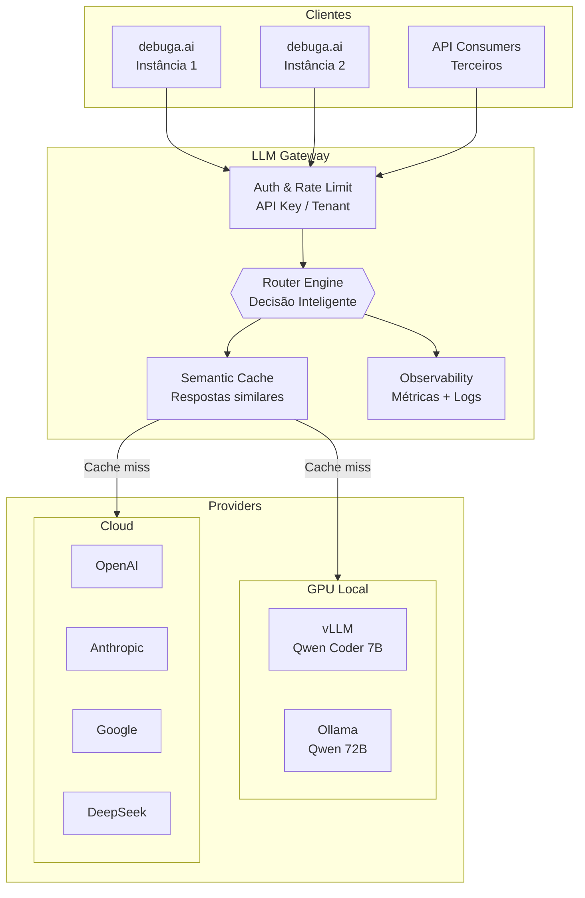
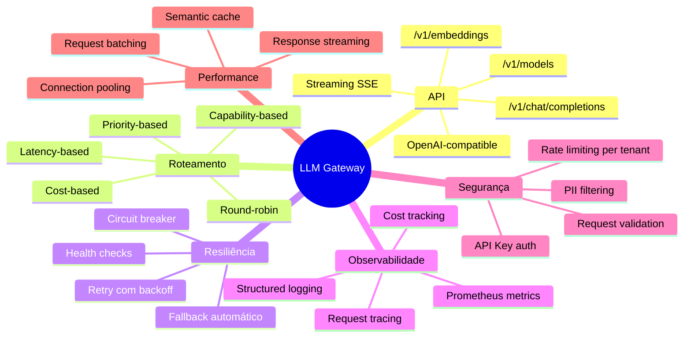
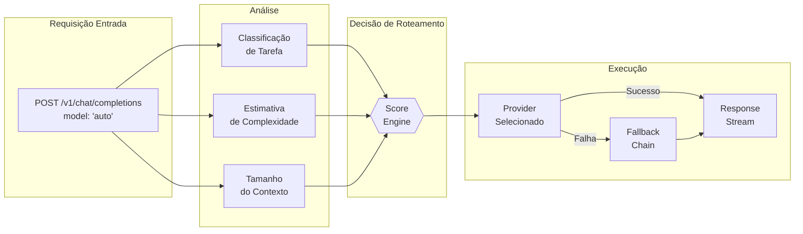
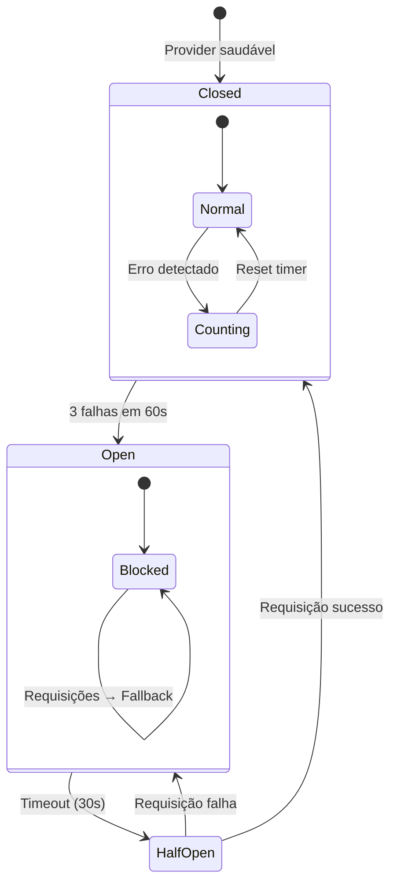
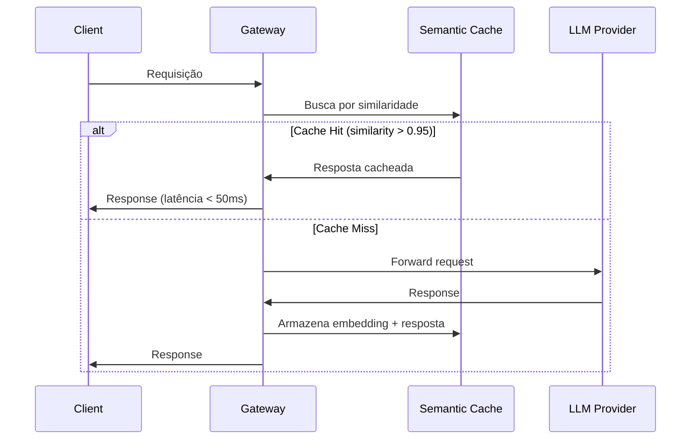
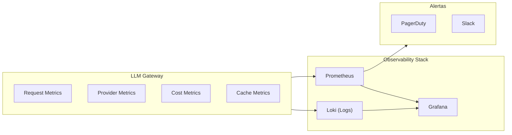
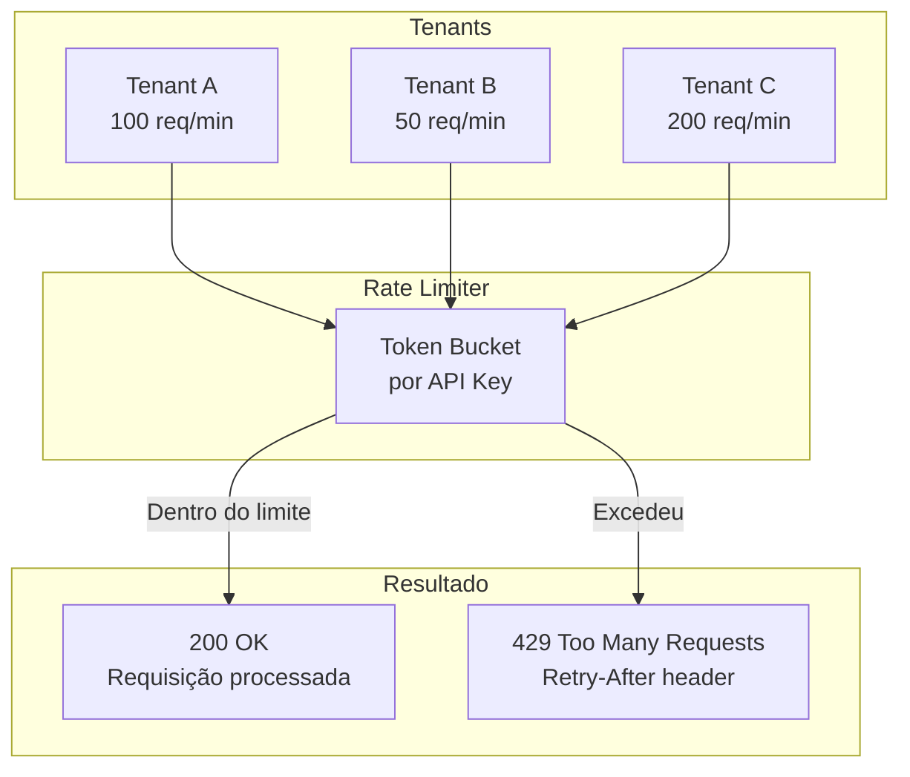

# debuga-llm-gateway

**Gateway unificado OpenAI-compatible para roteamento inteligente entre modelos locais (GPU) e providers cloud — com observabilidade, fallback automático e controle de custos.**

Desenvolvido por [Sperry Tecnologia](https://www.sperrytecnologia.com.br).

---

## Visão Geral

Este repositório implementa um gateway de inferência LLM que expõe uma API 100% compatível com o padrão OpenAI (`/v1/chat/completions`), roteando requisições de forma transparente entre modelos locais e providers cloud. Projetado para cenários enterprise da plataforma [debuga.ai](https://debuga.ai) onde múltiplas instâncias ou tenants compartilham infraestrutura de GPU.



---

## Funcionalidades



---

## Arquitetura de Roteamento



### Estratégias de Roteamento

| Estratégia | Descrição | Caso de Uso |
|-----------|-----------|-------------|
| **Priority-based** | Tenta providers em ordem de prioridade | Padrão — GPU local primeiro |
| **Latency-based** | Escolhe provider com menor latência recente | Aplicações real-time |
| **Cost-based** | Prioriza custo zero (local), cloud como fallback | Otimização de custo |
| **Capability-based** | Direciona por tipo de tarefa | Código → Coder, Imagem → Vision |
| **Round-robin** | Distribuição uniforme | Load balancing entre GPUs |

---

## Fallback e Circuit Breaker



| Estado | Comportamento | Duração |
|--------|--------------|---------|
| **Closed** | Tráfego normal para o provider | Indefinido |
| **Open** | Todo tráfego vai para fallback | 30s |
| **Half-Open** | 1 requisição de teste | Até resultado |

---

## Semantic Cache



| Métrica | Valor Típico |
|---------|-------------|
| Cache hit rate | 15-25% |
| Latência (cache hit) | < 50ms |
| Economia estimada | 20-30% custo cloud |
| TTL padrão | 1 hora |
| Threshold de similaridade | 0.95 |

---

## Observabilidade



| Métrica | Descrição | Alerta |
|---------|-----------|--------|
| `gateway_request_total` | Total de requisições | — |
| `gateway_request_duration_seconds` | Latência por provider | P99 > 10s |
| `gateway_provider_errors_total` | Erros por provider | > 5% |
| `gateway_cost_usd_total` | Custo acumulado | > limite/dia |
| `gateway_cache_hit_ratio` | Taxa de cache hit | < 10% |
| `gateway_circuit_open` | Circuit breakers abertos | Qualquer |
| `gateway_active_connections` | Conexões ativas | > 100 |

---

## Rate Limiting por Tenant



---

## API Reference

### Endpoints

| Método | Path | Descrição |
|--------|------|-----------|
| POST | `/v1/chat/completions` | Chat completion (streaming) |
| POST | `/v1/embeddings` | Geração de embeddings |
| GET | `/v1/models` | Lista modelos disponíveis |
| GET | `/health` | Health check |
| GET | `/metrics` | Métricas Prometheus |

### Exemplo de Uso

```bash
curl http://localhost:3000/v1/chat/completions \
  -H "Content-Type: application/json" \
  -H "Authorization: Bearer $API_KEY" \
  -d '{
    "model": "auto",
    "messages": [{"role": "user", "content": "Explain Docker networking"}],
    "stream": true
  }'
```

O modelo `"auto"` ativa o roteamento inteligente. Especificar um modelo (ex: `"qwen-coder-7b"`) força o provider correspondente.

---

## Deploy

```bash
# 1. Clone
git clone https://github.com/SperryTecnologia/debuga-llm-gateway.git
cd debuga-llm-gateway

# 2. Instale dependências
pnpm install

# 3. Configure
cp .env.example .env
# Edite com providers e API keys

# 4. Desenvolvimento
pnpm dev

# 5. Produção (Docker)
docker compose up -d
```

---

## Estrutura do Repositório

```
debuga-llm-gateway/
├── src/                  # Código-fonte TypeScript
│   ├── router/           # Lógica de roteamento
│   ├── providers/        # Adaptadores de providers
│   ├── cache/            # Semantic cache
│   ├── middleware/       # Auth, rate limit, logging
│   └── metrics/          # Prometheus exporters
├── tests/                # Testes unitários e integração
├── examples/             # Exemplos de uso
├── docs/                 # Documentação detalhada
├── docker-compose.yml    # Deploy containerizado
├── Dockerfile            # Imagem de produção
└── README.md
```

---

## Cenários de Uso

| Cenário | Descrição | Benefício |
|---------|-----------|-----------|
| **Multi-tenant** | Múltiplas instâncias compartilham GPU | Eficiência de recurso |
| **Enterprise** | Controle centralizado de custos e acesso | Governança |
| **Híbrido** | Dados sensíveis local, resto na cloud | Compliance |
| **High-availability** | Fallback automático entre providers | Uptime 99.9% |
| **Observabilidade** | Dashboard unificado de inferência | Visibilidade |

---

## Repositórios Relacionados

| Repositório | Descrição |
|-------------|-----------|
| [debuga-ai](https://github.com/SperryTecnologia/debuga-ai) | Plataforma principal |
| [debuga-llm-stack](https://github.com/SperryTecnologia/debuga-llm-stack) | Estratégia LLM híbrida (GPU + cloud) |
| [debuga-qwen-coder-lab](https://github.com/SperryTecnologia/debuga-qwen-coder-lab) | Avaliação de modelos para code generation |
| [debuga-vllm-engine](https://github.com/SperryTecnologia/debuga-vllm-engine) | Serving local com vLLM |

---

## Licença

Código do gateway sob licença MIT. O código de produção da plataforma é mantido em repositório privado.

---

*Sperry Tecnologia — Infraestrutura, segurança, DevOps e automação com IA.*
