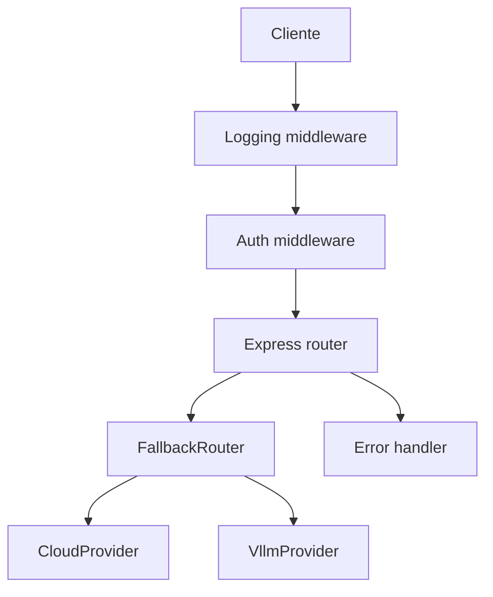

# Arquitetura

## Componentes públicos

## Seleção de provider

- `cloud`: cloud é o único provider utilizado;
- `local`: local é usado quando habilitado; caso contrário, cloud;
- `auto`: local é primário e cloud é fallback.

## Limites atuais

O código público não implementa tenant isolation, rate limiting, cache, persistência,
tracing distribuído, circuit breaker ou billing. Esses itens permanecem no roadmap.

## Decisões

- Express mantém o skeleton pequeno e conhecido;
- o contrato upstream é OpenAI-compatible;
- providers encapsulam base URL, headers, timeout e health;
- o gateway não armazena conversas.

## Deploy

O Dockerfile e o Compose são referências. Para ambiente controlado, fixe versões,
execute como usuário não privilegiado quando possível, use TLS, restrinja rede e configure
uma chave forte.
